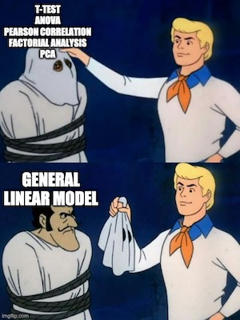
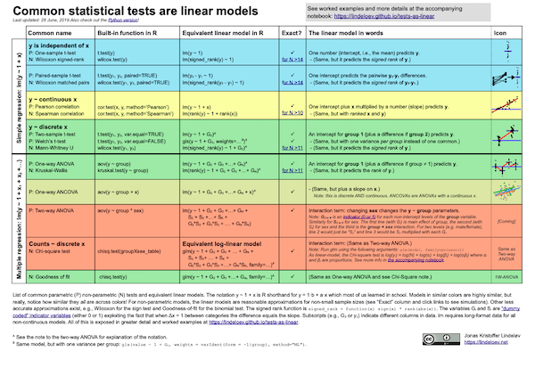
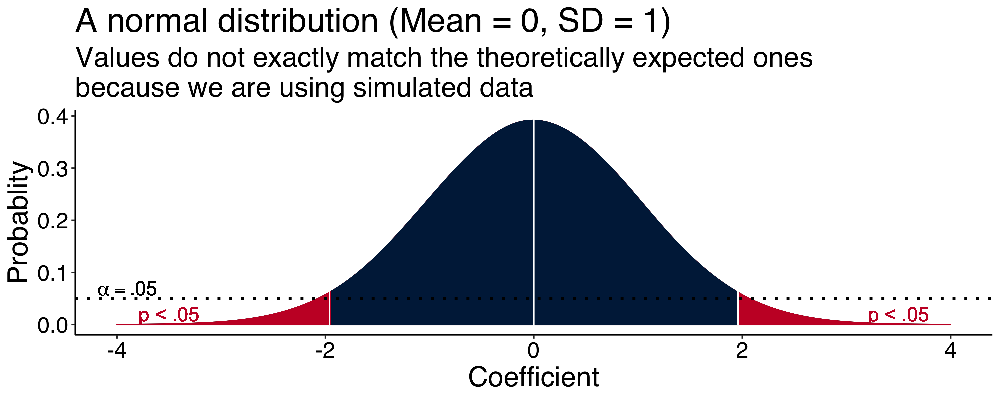
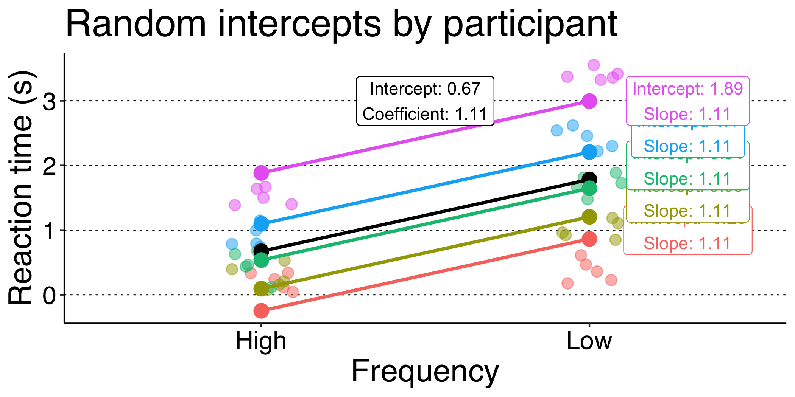
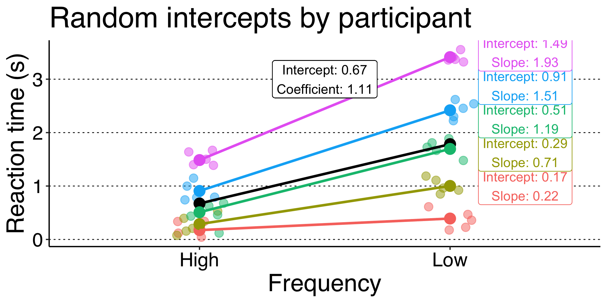

class: center, middle, section

## A primer on Mixed-Effects Models:<br>Theory and practice

.yellow[
Gonzalo García-Castro
]

.pull-left[
[](https://github.com/gongcastro)
]

.pull-right[
[](https://twitter.com/gongcastro)
]

<br><br><br><br>

25th March 2020

---
class: center, middle, section

```{r setup, include=FALSE}
options(htmltools.dir.version = FALSE)
knitr::opts_chunk$set(
	fig.height = 6,
	out.width = "100%"
)
knitr::opts_chunk$set(fig.height=6, out.width="100%")

```


```{r prepare, message=FALSE, warning=FALSE, include=FALSE, paged.print=FALSE}
# load packages
library(dplyr)
library(tidyr)
library(ggplot2)
library(knitr)
library(tibble)
library(truncnorm)
library(purrr)
library(latex2exp)
library(here)
library(lme4)
library(patchwork)

set.seed(888) # for reproducibility

```

# First of all...

---
## Disclaimer

I'm not a trained statistician

Don't trust me (too much)

Mistakes may (will) be made

I'm not 100% sure about anything

Probably, none of us will ever be

So let's get to it!

.pull-right-normal[

]

---
## Notation

.centered[Linear Mixed-Effects Models = LMM]

**Mixed Models** (aka. Mixed-Effects Models, aka. Multilevel Models, aka. Hierarchical Models, aka. Nested Data Models, aka. Random Parameter Models, aka. Split-Plot Designs)

<br>

If by the end of this presentation you have an intuition about why all **these labels refer to the same thing**

Yay! You have made so much progress.

---

## Disclaimer (bonus)

Most statistical literature on LMM uses **R** (e.g., `lmer` package)

Many other programming languages support LMM

* Python: `statsmodels` library, `Pymer4` [@jolly2018]
* Matlab: `Statistics and Machine Learning Toolbox`
* Julia (explicitely created for LMM)
* Stan: `Bayesian modelling`, with interfaces with R, Python and Matlab)

I don't assume you are familiar with R, but I will use some R code for illustration purposes.

---
class: center, middle, section

# Materials

Some recommended reads.

---
### Materials: Books and book chapters

.small[
Navarro, D. J. (2015). Learning statistics with r: A tutorial for psychology students and other beginners.

Field, A., Miles, J., & Field, Z. (2012). 19. Multilevel linear models. In Discovering statistics using r. SAGE Publications.

Winter, B. (2019). Statistics for linguists: An introduction using R. Routledge.

Mirman, D. (2016). 4. Structuring random effects. In Growth curve analysis and visualisation using r. CRC press.

Gelman, A., & Hill, J. (2006). Data analysis using regression and multilevel/hierarchical models. Cambridge University press.

Fox, J., & Weisberg, S. (2018). An r companion to applied regression. SAGE publications.

McElreath, R. (2020). Statistical rethinking: A bayesian course with examples in r and stan. CRC press.
]

---

### Materials: Articles

.small[
Winter, B. (2013). Linear models and linear mixed effects models in R with linguistic applications. arXiv Preprint arXiv:1308.5499. https://arxiv.org/abs/1308.5499

DeBruine, L., & Barr, D. J. (2019). Understanding mixed effects models through data simulation. https://doi.org/10.31234/osf.io/xp5cy

Barr, D. J., Levy, R., Scheepers, C., & Tily, H. J. (2013). Random effects structure for confirmatory hypothesis testing: Keep it maximal. Journal of Memory and Language, 68(3), 255–278.

Barr, D. J. (2013). Random effects structure for testing interactions in linear mixed-effects models. Frontiers in Psychology, 4, 328. https://www.frontiersin.org/articles/10.3389/fpsyg.2013.00328/full

Bates, D., Kliegl, R., Vasishth, S., & Baayen, H. (2015a). Parsimonious mixed models. arXiv Preprint arXiv:1506.04967. https://arxiv.org/pdf/1506.04967.pdf

Baayen, R. H., Davidson, D. J., & Bates, D. M. (2008). Mixed-effects modeling with crossed random effects for subjects and items. Journal of Memory and Language, 59(4), 390–412. https://doi.org/10.1016/j.jml.2007.12.005

Barr, D. J. (2008). Analyzing “visual world” eyetracking data using multilevel logistic regression. Journal of Memory and Language, 59(4), 457–474. https://doi.org/10.1016/j.jml.2007.09.002

]

---

### Materials: Articles (special mentions)

.small[
Meteyard, L., & Davies, R. A. (2020). Best practice guidance for linear mixed-effects models in psychological science. Journal of Memory and Language, 112, 104092. https://doi.org/10.1016/j.jml.2020.104092

Bates, D., Mächler, M., Bolker, B., & Walker, S. (2015b). Fitting linear mixed-effects models using lme4. Journal of Statistial Software, 67(1). https://doi.org/10.18637/jss.v067.i01
]

---
class: section, middle, center

# Modelling

A reminder.


---
## Modelling: What for?

To estimate a **parameter** that characterises a population using data from samples of that population.

This unknown **parameter** can be whatever we want:

* Central tendency measures (e.g., mean, median)
* Dispersion measures (e.g., standard deviation)
* Measures of association between variables (e.g., coefficients)

We usually estimate all of them when analysing data and perform some kind of **statistical inference** from them.
 

---
## Modelling: What for?

In confirmatory analyses, we:

1) Hypothesise that the parameter is within a range of values

2) Collect data

3) Perform statistical inference

<br>

* **Frequentist approach**: what is the probability of our data, assuming our hypothesis is true?
* **Bayesian approach**: what is the probability of our hypothesis, given the data?

---
## Modelling: What for?

In experimental confirmatory research, we are usually interesed in **estimating the association between two or more variables**:

* *Age* (predictor) and *vocabulary size* (outcome)
* *Bilingualism* (predictor) and *novelty preference* (outcome)
* *Native linguistic rythmic class* (predictor) and *entrainment to speech signal* (outcome)

We try draw a shape (e.g., line, curve) that defines this relationship.

For now, we will stick to óne shape: **lines**.

---
## Modelling: What for

The three (four, sometimes) steps of modelling:

1) **Model especification**: what variables am I going to include in the model?

2) **Model fitting**: what line fits data the best?

3) **Statistical inference**: Does my model fit data good enough? What is the contribution of each predictor to the goodness of fit?

4) (Bonus track) **Model validation**: Does my model predict new outcomes correctly?

---
## Modelling: 1) Model especification

We need to define what **outcomes** and **predictors** I am interested in.

> - e.g., what am I trying to predict? What variables am I using to predict it?

What are my **assumptions** about how they relate to the outcome?

> - e.g., linearity, normality of residuals

What are my assumptions about **how each predictor relates to the other predictors**?+
    
> - e.g., do I expect interactions between predictors?
    
---
## Modelling: 1) Model especification

We will work with **linear** models

This means that we will try to draw a **line** that defines the relationship between predictors and outcome.

But bear in mind that **non-linear models** exist as well

For instance, we may need/want to fit a **curve** or an **exponential** function

> - e.g. Growth Curve Analysis
    
---
## Modelling: 1) Model especification

Every line is defined by the following equation, named the **General Linear Model (GLM)**:

$$
Y = \beta_0+\beta_j \times X + \varepsilon
$$

Where:

* $Y$ is the value that the outcome variable takes (we know this value)
* $\beta_0$ is the intercept
* $\beta_j$ is the coefficient
* $X_j$ is the value that the predictor $X$ takes (we know this value)
* $\varepsilon$: residual (error the model makes)

---
class: center

## Modelling: 1) Model especification

$$
Y = \beta_0+\beta_1 \times X
$$

This formula underlies most statistical techinques we use normally:

```{r echo=FALSE, message=FALSE, warning=FALSE, paged.print=FALSE, out.width="25%"}



```

---
class: center

## Modelling: 1) Model especification


Most of them are generalised or special cases of the the **GLM**.

.centered[
[](https://lindeloev.github.io/tests-as-linear/)
]

---
## Modelling: 1) Model specification

We can extend the GLM to include more predictors:

$$
Y = \beta_0 + \beta_1 X_1 + \beta_2 X_2 + ... +  \beta_j  X_j
$$

Each coefficient (e.g., $\beta_1$, $\beta_2$) will contribute to the model by "adjusting" the line.

But how much should each coefficient contribute?

We need to takea look at the data

---
## Modelling: 2) Model fitting

There are infinite lines we can draw with these parameters.

$$
Y = \beta_0 + \beta_1 X_1 + \beta_2 X_2 + ... +  \beta_j \times X_j
$$

We need to find the combination of values of the coefficients $\beta_0$ and $\beta_j$ that make the line fit data the best.

We need to find the **Least Squares Regression Line**

This line **minimises the overall distance between the lines and the data points**

How to find it? We use built-in **algorithms** that try a lot of combinations until finding the optimal one.

---
class: center

## Modelling: 2) Model fitting

Play with regression lines:

https://antoinesoetewey.shinyapps.io/statistics-202/

---
## Modelling: 3) Statistical inference

We have obtained **coefficients** that define the slope and position of the line that fits data the best.

But **"best"** is relative.

Even the best model could be fitting the data very badly

We need to assess how wuch of the variance our model accounts for.

Compute *$R^2$* (proportion of variance accounted for the model)

If the model shows nice fit, let's smove on to **interpret the coefficients**!

---
## Modelling: 3) Statistical inference

We have a bunch of **coefficients**

Each coefficient tells us **how much each predictor contributes to the slope** of the line

All coefficients contribute to some degree. $\beta_j = 0$ is almost impossible.

**What coefficients contribute significantly?**

---
## Modelling: 3) Statistical inference

Imagine that the **true (population) value of coefficient** $\beta_1$ is 0

This means that it has **no predictive value** regarding the outcome variable

How what is the probability of $\beta_1$ taking the value it takes in our sample, **assuming that $\beta_1 = 0$** is true? 

If it is very **unlikely**, we should **reject** the assumption that $\beta_1 = 0$

If its **likely enough**, we **don't reject** the assumption that $\beta_1 = 0$

---
## Modelling: 3) Statistical inference

How can we know the **likelihood of our coefficient**?

We need to map it onto a **probability distribution**.

A probability distribution tells us the probability of each value a variable can take.

Different variables can follow different distributions:

* Gaussian (aka. normal, aka. exponential)
* Student's *t*
* Snedecor's *F*
* Poisson
* ...

---
## Modelling: 3) Statistical inference

We know that **coefficients** in linear models tend to follow a **Gaussian distribution**. This distribution is known.

It tells us the **probability** of each value of our coefficient, **assuming that its true value is 0**.

---
## Modelling: 3) Statistical inference

```{r distribution, warning=FALSE, dev="svg", include=FALSE, out.width="50%"}

dens <- density(rnorm(1000000), bw = 0.2)
data <- tibble(x = dens$x, y = dens$y) %>% 
  mutate(variable = between(x, qnorm(0.025), qnorm(0.975)))

distribution_plot <- ggplot(data, aes(x, y)) +
  geom_line() +
  geom_area(fill = "#C8102E", colour = "#C8102E") +
  geom_area(data = filter(data, variable), fill = "#002147",
            colour = "#002147") +
  geom_vline(xintercept = 0, colour = "white") +
  geom_hline(yintercept = 0.05, colour = "black", linetype = "dotted", size = 1) +
  geom_text(aes(x = -3.90, y = 0.07), size = 5, label = TeX("$\\alpha = .05$")) +
  geom_segment(x = qnorm(0.025), xend = qnorm(0.025), y = 0, yend = 0.1, colour = "white") +
  geom_segment(x = qnorm(0.975), xend = qnorm(0.975), y = 0, yend = 0.1, colour = "white") +
  geom_text(aes(y = 0.02, x = -3.5, label = "p < .05"), colour = "#C8102E", size = 5) +
  geom_text(aes(y = 0.02, x = 3.5, label = "p < .05"), colour = "#C8102E", size = 5) +
  labs(x = "Coefficient", y = "Probablity",
       title = "A normal distribution (Mean = 0, SD = 1)",
       subtitle = "Values do not exactly match the theoretically expected ones\nbecause we are using simulated data") +
  scale_x_continuous(limits = c(-4, 4)) +
  theme(panel.grid = element_blank(),
        panel.background = element_rect(fill = "transparent"),
        text = element_text(size = 20, family = "Helvetica"),
        axis.line = element_line(colour = "black"),
        axis.text = element_text (colour = "black", family = "Helvetica"))

ggsave(plot = distribution_plot, "distribution.png", height = 4, width = 10)

```

```{r echo=FALSE, message=FALSE, warning=FALSE, out.width="100%", paged.print=FALSE}



```

---
## Modelling: 3) Statistical inference

We can map the probability of our coefficient onto this distribution to find its **associated probability**

If the probability is lower than our **significance threshold** (e.g., $\alpha = .05$), we **reject the hypothesis** that the true value of the coefficient is 0!

We **interpret** the model goodness of fit, the coefficients, and draw (or do not draw) conclusions from them.

---
## Modelling: Assumptions!

We assume many things, one of the, being that observations are independent from each other.

This means that the **probability** of one observation taking one value is independent from the value other observations have taken.

```{r balls, echo=FALSE, message=FALSE, warning=FALSE, paged.print=FALSE, out.width="30%"}


```


---
class: center, middle, inverse

# Introducing random effects in our linear model

---
## What is a LMM

An extension of the GLM that allows to account for systematic sources of variability beyond our effects of interest.

All models are unnacurate to some degree.

Sometimes, part of the error the model makes is systematic.

---
## Why to use a LMM

Effect of word frequency on reaction time task in a lexical decision task.

* Word condition:
    - High frequency: CAR > Yes/No
    - Low frequency: FLAG > Yes/No
* Non-word condition: FOIR > Yes/No

Does frequency affect reaction times?

---
## Why to use a LMM

```{r task, echo=FALSE, message=FALSE, warning=FALSE, paged.print=FALSE, out.width="100%"}

n_subj <- 5
n_trials <- 10
means <- c(0.1, 0.3, 0.55, 0.9, 1.5)


task_data <- tibble(participant = rep(paste0("participant", 1:n_subj), each = n_subj*2),
       trial = rep(1:n_trials, times = n_subj),
       freq = rep(c("High", "Low"), each = n_trials/2, times = n_subj),
       rt = c(rtruncnorm(n = 5, a = 0, b = Inf, mean = means[1], sd = 0.2),
              rtruncnorm(n = 5, a = 0, b = Inf, mean = means[1]+0.3, sd = 0.2),
              rtruncnorm(n = 5, a = 0, b = Inf, mean = means[2], sd = 0.2),
              rtruncnorm(n = 5, a = 0, b = Inf, mean = means[2]+0.7, sd = 0.2),
              rtruncnorm(n = 5, a = 0, b = Inf, mean = means[3], sd = 0.2),
              rtruncnorm(n = 5, a = 0, b = Inf, mean = means[3]+1, sd = 0.2),
              rtruncnorm(n = 5, a = 0, b = Inf, mean = means[4], sd = 0.2),
              rtruncnorm(n = 5, a = 0, b = Inf, mean = means[4]+1.5, sd = 0.2),
              rtruncnorm(n = 5, a = 0, b = Inf, mean = means[5], sd = 0.2),
              rtruncnorm(n = 5, a = 0, b = Inf, mean = means[5]+2, sd = 0.2)
       )
)

model <- lm(rt ~ freq, data = task_data)
model_int <- lmer(rt ~ freq + (1|participant), data = task_data)
model_slo <- lmer(rt ~ freq + (1+freq|participant), data = task_data)
model_slo_no <- lmer(rt ~ freq + (0+freq|participant), data = task_data)


task_plot_fix <- ggplot(task_data, aes(freq, rt)) +
    geom_jitter(alpha = 0.5, size = 3, width = 0.1) +
    stat_summary(aes(y = fitted(model)), fun.y = "mean", geom = "point", size = 4) +
    stat_summary(aes(group = 1), fun.y = "mean", geom = "line", size = 1) +
    geom_label(x = 1.5, y = 2, label = paste0("Intercept: ", round(model$coefficients[1], 2), "\nSlope: ", round(model$coefficients[2], 2))) +
    labs(x = "Frequency", y = "Reaction time (s)", colour = "Participant",
         title = "No random effects") +
    theme(panel.grid = element_blank(),
          panel.grid.major.y = element_line(linetype = "dotted", colour = "grey10"),
          panel.background = element_rect(fill = "transparent"),
          text = element_text(size = 20, family = "Helvetica"),
          axis.line = element_line(colour = "black"),
          axis.text = element_text (colour = "black", family = "Helvetica"),
          legend.position = "none")

model_int_coefs <- data.frame(participant = paste0("participant", 1:5),
                              x1 = 2.3,
                              y1 = seq(1, 3, length.out = 5),
                              intercept = round(coef(model_int)$participant[, 1], 2),
                              slope = round(coef(model_int)$participant[, 2], 2))

task_plot_int <- ggplot(task_data, aes(freq, rt, colour = participant)) +
    geom_jitter(alpha = 0.5, size = 3, width = 0.1) +
    stat_summary(aes(y = fitted(model_int), group = 1), fun.y = "mean", geom = "point", size = 4) +
    stat_summary(aes(y = fitted(model_int), group = 1), fun.y = "mean", geom = "line", size = 1) +
    stat_summary(aes(y = fitted(model_int), group = participant), fun.y = "mean", geom = "point", size = 4) +
    stat_summary(aes(y = fitted(model_int), group = participant), fun.y = "mean", geom = "line", size = 1) +
    geom_label(x = 1.5, y = 3, colour = "black",
               label = paste0("Intercept: ", round(summary(model_int)$coefficients[1, 1], 2),
                              "\nCoefficient: ", round(summary(model_int)$coefficients[2, 1], 2))) +
    geom_label(data = model_int_coefs, aes(x = x1, y = y1, label = paste0("Intercept: ", intercept, "\nSlope: ", slope), colour = participant)) +
    labs(x = "Frequency", y = "Reaction time (s)", colour = "Participant",
         title = "Random intercepts by participant") +
    theme(panel.grid = element_blank(),
          panel.grid.major.y = element_line(linetype = "dotted", colour = "grey10"),
          panel.background = element_rect(fill = "transparent"),
          text = element_text(size = 20, family = "Helvetica"),
          axis.line = element_line(colour = "black"),
          axis.text = element_text (colour = "black", family = "Helvetica"),
          legend.position = "none")

model_slo_coefs <- data.frame(participant = paste0("participant", 1:5),
                              x1 = 2.3,
                              y1 = seq(1, 3.5, length.out = 5),
                              intercept = round(coef(model_slo)$participant[, 1], 2),
                              slope = round(coef(model_slo)$participant[, 2], 2))

task_plot_slo <- ggplot(task_data, aes(freq, rt, colour = participant)) +
    geom_jitter(alpha = 0.5, size = 3, width = 0.1) +
    stat_summary(aes(y = fitted(model_slo), group = 1), fun.y = "mean", geom = "point", size = 4) +
    stat_summary(aes(y = fitted(model_slo), group = 1), fun.y = "mean", geom = "line", size = 1) +
    stat_summary(aes(y = fitted(model_slo), group = participant), fun.y = "mean", geom = "point", size = 4) +
    stat_summary(aes(y = fitted(model_slo), group = participant), fun.y = "mean", geom = "line", size = 1) +
    geom_label(x = 1.5, y = 3, colour = "black",
               label = paste0("Intercept: ", round(summary(model_slo)$coefficients[1, 1], 2),
                              "\nCoefficient: ", round(summary(model_slo)$coefficients[2, 1], 2))) +
    geom_label(data = model_slo_coefs, aes(x = x1, y = y1, label = paste0("Intercept: ", intercept, "\nSlope: ", slope), colour = participant)) +
    labs(x = "Frequency", y = "Reaction time (s)", colour = "Participant",
         title = "Random intercepts by participant") +
    theme(panel.grid = element_blank(),
          panel.grid.major.y = element_line(linetype = "dotted", colour = "grey10"),
          panel.background = element_rect(fill = "transparent"),
          text = element_text(size = 20, family = "Helvetica"),
          axis.line = element_line(colour = "black"),
          axis.text = element_text (colour = "black", family = "Helvetica"),
          legend.position = "none")

ggsave(plot = task_plot_fix, "task_fix.png", height = 3.5, width = 7)
ggsave(plot = task_plot_int, "task_int.png", height = 3.5, width = 7)
ggsave(plot = task_plot_slo, "task_slo.png", height = 3.5, width = 7)

```

```{r echo=FALSE, message=FALSE, warning=FALSE, paged.print=FALSE, outwidth="50%"}

include_graphics("task_fix.png")

```

---
## Why to use a LMM

```{r echo=FALSE, message=FALSE, warning=FALSE, paged.print=FALSE, outwidth="50%"}



```

---
## Why to use a LMM

```{r echo=FALSE, message=FALSE, warning=FALSE, paged.print=FALSE, outwidth="70%"}



```

---
## Why to use a LMM

* To avoid aggregating data (more statistical power)
* To account for non-independence of scores
* To account for hierachical structures in our data
* To account for cross-observational unit variability

---
## When to use a LMM


---
## How to use a LMM


---
class: center, middle, inverse

# Some additional points

---
## Power analysis in Mixed Models

LMM involved the estimation of many parameters.

To perform power analysis, we need to fix some of these parameters

It's difficult to come up with **sensible parameters** *a priori*

* How much variability am I expecting for each random effect?
* How much correlation am I expecting between random efects?

---
## Power analysis in Mixed Models

Also, estimating power analytically (mapping expected parameters onto known distributions) is not straightforward in LMM.

It's not quite clear what parameters we are referring to.

Alternative: shift to simulation-based power analysis. Already available for non-mixed models (e.g., ANOVA). See @lakens19 and it's accompanying R package, `ANOVApower`.

Some methods are already available for mixed-models:

* @zhang2009: Includes non-linear models, but it's implemented in commercial software (SAS)
* @debruine2019

---
## When our model fails to converge

Sometimes, our model can't figure out what parameters are most likely given the data

This can be because different values of the same coefficient are equally likely

How to avoid this:

* The larger the data, the easier to converge.
* The large values of the coefficients the more difficult to converg converge. Consider:
    - Changing units of measurement: use seconds instead of miliseconds [@barr2008].
    - Consider estandardising your predictors.
* Don't get too fancy with your model: the more parsimonious, the better (less parameters to estimate).

---
## When our model is overly complex

---
## Missing data


---
class: center, middle, inverse
# Bibliography

## Bibliography

<div class="citation">


---